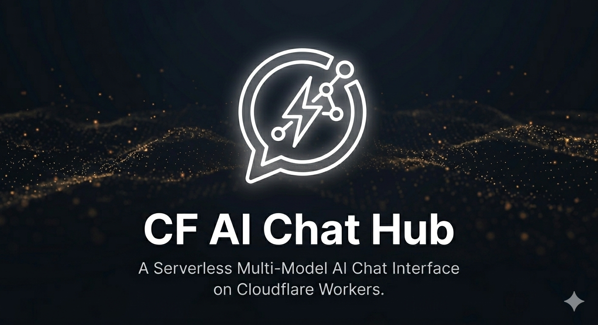

  
  <h1>⚡ CF-AIChat</h1>
  
基于 Cloudflare Workers 的高性能、零成本多模型 AI 聊天终端

  

   
   

  
  
  

---

## ✨ 核心功能
* **🔄 动态模型同步**：自动实时对接 Cloudflare AI 最新模型库，支持 Llama 3.3, DeepSeek R1, Qwen 2.5 等 60+ 模型，无需手动更新代码。
* **💾 智能会话管理**：支持多会话上下文切换，本地持久化存储聊天历史，刷新页面也不会丢失对话。
* **🖼️ 多模态视觉感知**：内置 LLaVA 模型支持，直接上传图片即可进行深度对话与视觉分析。
* **🌐 专属翻译面板**：集成 `m2m100` 模型，提供专业级多语言双向实时对译功能。
* **📊 实时消耗统计**：通过 API 直连 Cloudflare 后台，实时掌握 Neurons 消耗与请求频率。
* **🚀 极速流式响应**：采用 SSE (Server-Sent Events) 技术，体验近乎零延迟的打字机输出效果。
* **🔐 安全鉴权体系**：支持自定义后台密码及动态 Token 验证，确保您的 AI 资源不被非法盗用。

## 🛠️ 部署指南
### 方案 A：一键部署（推荐）
只需点击页面上方的 **[Deploy to Cloudflare Workers]** 按钮，按照提示授权 GitHub 和 Cloudflare 即可自动完成。

### 方案 B：手动部署
1. 克隆仓库：`git clone https://github.com/CF-Works/CF-AIChat.git`
2. 安装依赖并登录：`npm install && npx wrangler login`
3. 部署：`npx wrangler deploy`

> **重要提示**：部署完成后，请在 Cloudflare 控制台的 **Workers & Pages -> Settings -> Variables** 中添加 `ADMIN_PASSWORD` (登录密码) 环境变量。

## ⚙️ 配置参数 (Environment Variables)

| 变量名 | 类型 | 说明 |
| :--- | :--- | :--- |
| `ADMIN_PASSWORD` | **必填** | 登录聊天界面的唯一密码 |
| `CF_ACCOUNT_ID` | 可选 | 用于查询额度消耗的账户 ID |
| `CF_API_TOKEN` | 可选 | 需具备 `Workers AI: Read` 权限的 API 令牌 |

## 🤝 参与贡献
* 发现了 Bug？[提交一个 Issue](https://github.com/CF-Works/CF-AIChat/issues)
* 有好的想法？[发起一个 Pull Request](https://github.com/CF-Works/CF-AIChat/pulls)
* 喜欢这个项目？请给个 **Star** ⭐ 鼓励一下！

## 📄 开源协议
基于 [MIT License](LICENSE) 开源。
